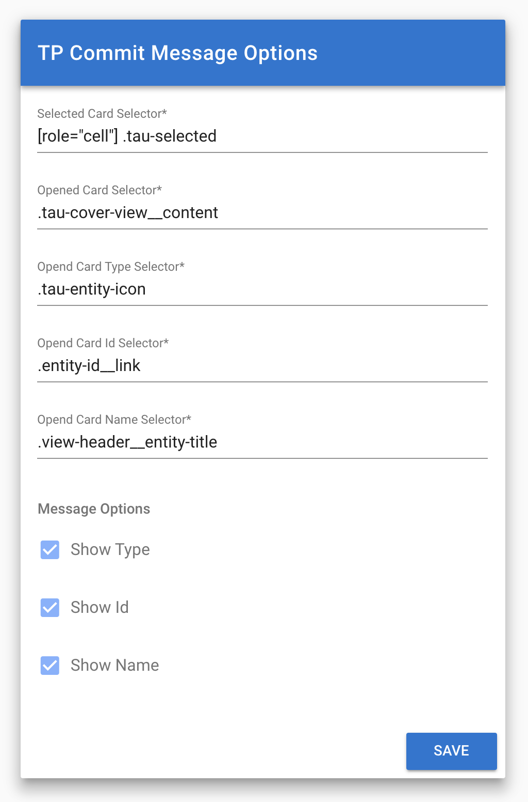

# Target Process Commit Message Generator
> Copy the Title / Type / Name of the current selected or opened card to your clipboard ✄

## Installation
- Clone this repository and run `yarn && yarn build`.
- Navigate to chrome://extensions
- Expand the Developer dropdown menu and click “Load Unpacked Extension”
- Navigate to the local folder containing the extension’s code (`/build` directory) and click Ok

## Development
- Just run `yarn dev`
- Load extension into chrome (see above)
- Everything should work with hot reloading

## Roadmap
- Restore default options
